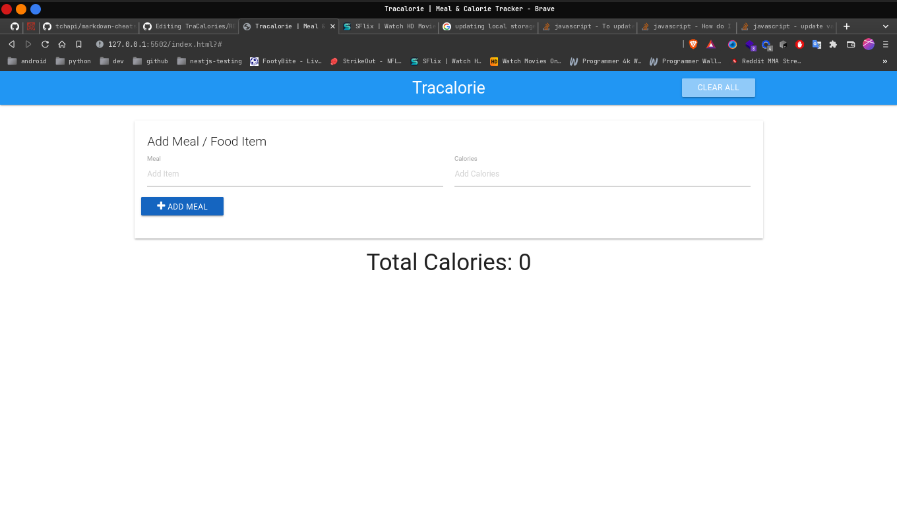

# Tracalorie

Tracalorie is a Front End JavaScript Application that allows users to intreduce what they have eating for a day and
then it calculates the sum of calories of the meals.

Uses:

- [x] DOM
- [x] VanillJS
- [x] Local Storage

Demo link[Traclories]
